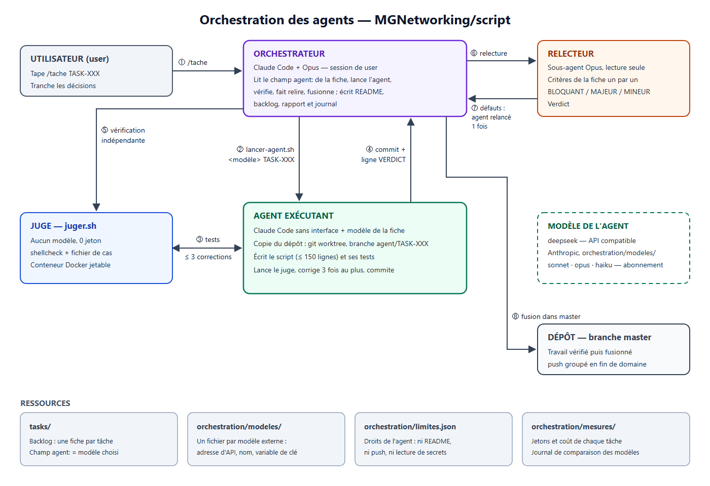

# orchestration/ — les agents IA de ce dépôt

Tout ce qui organise le travail des agents est ici, et nulle part ailleurs — sauf
ce que Claude Code impose de trouver dans `.claude/`.

## Le principe

**Claude Code est l'orchestrateur et le harness.** La session Claude Code de `user`
(Opus) répartit les tâches du backlog entre des agents. Chaque agent est une autre
instance de Claude Code, lancée sans interface, qui travaille avec **le modèle
choisi pour la tâche** : DeepSeek, Sonnet, ou tout autre modèle ajouté plus tard.
Mêmes outils, mêmes règles ; seul le modèle change.



Source modifiable : [schema/orchestration.svg](schema/orchestration.svg). Après modification, régénérer le PNG :

```bash
msedge --headless=new --hide-scrollbars --screenshot=orchestration/schema/orchestration.png --window-size=1400,960 orchestration/schema/orchestration.svg
```

## Qui fait quoi

| Rôle | Qui | Consigne |
|---|---|---|
| Orchestrateur | votre session Claude Code | [.claude/commands/tache.md](../.claude/commands/tache.md) |
| Agent exécutant | Claude Code + le modèle de la fiche | [.claude/commands/executer-tache.md](../.claude/commands/executer-tache.md) |
| Relecteur | sous-agent Opus, lecture seule | [.claude/agents/relecteur.md](../.claude/agents/relecteur.md) |
| Atomiseur | sous-agent, découpe un domaine en fiches | [.claude/commands/atomiser.md](../.claude/commands/atomiser.md) |
| Juge | `outils/juger.sh`, sans modèle : shellcheck + tests en conteneur | — |

## Le partage des tâches

Chaque fiche de `tasks/` porte `agent:` — le modèle le moins cher capable de la
réussir, choisi à l'atomisation :

| Travail | Agent |
|---|---|
| script simple, lecture seule ou un seul effet | `deepseek` |
| effets enchaînés, restauration, destructif | `sonnet` |
| décision, frontière, ADR, `lib/common.sh` | `orchestrateur` |

Le choix se révise sur les chiffres de `mesures/`, pas sur une impression. Chaque
agent travaille dans sa copie (`../script-agents/<TASK>`) : plusieurs pourront
tourner en parallèle, une fois trois tâches passées sans incident (décision 40).

## Le contenu du dossier

| Fichier | Rôle |
|---|---|
| [regles.md](regles.md) | ce que orchestrateur et agents ont le droit de faire |
| [decisions.md](decisions.md) | les décisions en vigueur, numérotées |
| [limites.json](limites.json) | les droits techniques d'un agent (écriture, commandes) |
| `modeles/` | un fichier par modèle **externe** : adresse d'API, nom, variable de clé |
| `outils/lancer-agent.sh` | crée la copie, lance l'agent, relève ses jetons |
| `outils/juger.sh` | shellcheck et fichier de cas d'une fiche, en conteneur |
| `mesures/journal.md` | coût, défauts et rattrapage de chaque tâche |
| `mesures/agents.tsv` | jetons de chaque lancement d'agent (créé au premier) |

`.claude/` ne contient que ce que Claude Code charge : commandes, sous-agents,
permissions. Aucune règle métier.

## Ajouter un modèle

- **Modèle Claude** (`sonnet`, `opus`, `haiku`) : rien à faire, écrire son nom dans
  le champ `agent` d'une fiche.
- **Modèle externe** : créer `modeles/<nom>.env`, sans aucune clé :

  ```text
  ADRESSE=https://api.exemple.com/anthropic
  MODELE=nom-du-modele
  VARIABLE_CLE=EXEMPLE_API_KEY
  ```

  Condition : son API accepte le format d'Anthropic. La clé se pose dans la
  variable d'environnement nommée, jamais dans le dépôt.

## Points ouverts

Décidés ou constatés, pas encore faits. À relire avant de lancer une tâche.

1. **Essai comparatif de relecture — décidé le 2026-09-14, à faire sur la
   prochaine tâche.** Le même travail est relu deux fois : par Opus (référence)
   et par un modèle moins cher (Sonnet en sous-agent, ou DeepSeek). On compare les
   défauts trouvés et les jetons, dans `mesures/journal.md`. Opus reste le
   relecteur tant que l'essai n'a pas tranché.
2. **`.claude/agents/relecteur.md` déclare encore `model: sonnet`** : `/tache`
   impose Opus à l'appel, donc sans effet. Alignement reporté à la fin des
   corrections, selon le résultat de l'essai 1.
3. **Consignes d'agent non encore éprouvées** : limite de 150 lignes comptée
   avant le commit, figement des tests levé par les retours de relecture
   (ajoutées après TASK-033).
4. **Tâches hors script** (README, schéma, documentation) : le circuit d'agent ne
   les couvre pas — `limites.json` interdit les README et `docs/`, `juger.sh`
   attend un script et son fichier de cas. L'orchestrateur les fait lui-même.
5. **Coût réel de TASK-033** estimé à ≈ 0,25 $ ; à confirmer sur le tableau de
   bord DeepSeek.
6. **Parallélisme** : fermé jusqu'à trois tâches passées sans incident
   (1 sur 3 : TASK-033).
7. **`git push`** : groupé en fin de domaine Docker, rien n'est poussé depuis le
   début de ces travaux.
