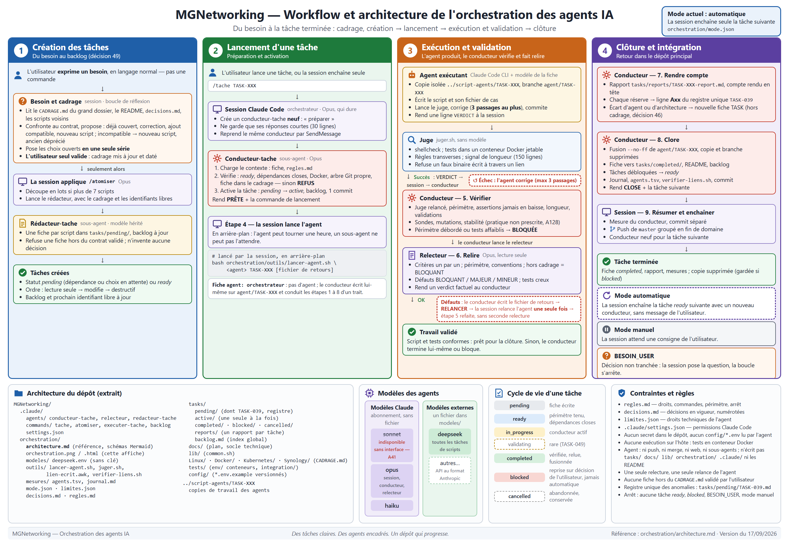

# orchestration/ — les agents IA de ce dépôt

Tout ce qui organise le travail des agents est ici, et nulle part ailleurs — sauf
ce que Claude Code impose de trouver dans `.claude/`.

## Le principe

**Claude Code est l'orchestrateur et le harness.** La session Claude Code de `user`
(Opus) répartit les tâches du backlog entre des agents. Chaque agent est une autre
instance de Claude Code, lancée sans interface, qui travaille avec **le modèle
choisi pour la tâche** : DeepSeek, Sonnet, ou tout autre modèle ajouté plus tard.
Mêmes outils, mêmes règles ; seul le modèle change.



*Affiche d'exposition du 17/09/2026, source modifiable [orchestration.html](orchestration.html) (export PNG décrit en tête du fichier). En cas d'écart, [architecture.md](architecture.md)
fait foi.*

**L'architecture complète — acteurs, lieux, artefacts, cycle d'une tâche, états,
contrôles, arrêts, écarts connus — et ses schémas sont dans
[architecture.md](architecture.md).** Les schémas y sont écrits en Mermaid, rendus
directement par GitHub : ils se modifient avec le texte, dans le même commit.

## Qui fait quoi

| Rôle | Qui | Consigne |
|---|---|---|
| Orchestrateur | votre session Claude Code, qui dure | [.claude/commands/tache.md](../.claude/commands/tache.md) |
| Conducteur | sous-agent neuf par tâche : prépare, vérifie, fait relire, clôt ; ne rend que des résumés | [.claude/agents/conducteur-tache.md](../.claude/agents/conducteur-tache.md) |
| Agent exécutant | Claude Code + le modèle de la fiche | [.claude/commands/executer-tache.md](../.claude/commands/executer-tache.md) |
| Relecteur | sous-agent Opus, lecture seule | [.claude/agents/relecteur.md](../.claude/agents/relecteur.md) |
| Atomiseur | commande `/atomiser` de la session, qui découpe un domaine et délègue l'écriture des fiches au sous-agent `redacteur-tache` | [.claude/commands/atomiser.md](../.claude/commands/atomiser.md), [.claude/agents/redacteur-tache.md](../.claude/agents/redacteur-tache.md) |
| Juge | `outils/juger.sh`, sans modèle : shellcheck + tests en conteneur | — |

## Le partage des tâches

Chaque fiche de `tasks/` porte `agent:` — le modèle le moins cher capable de la
réussir, choisi à l'atomisation :

| Travail | Agent |
|---|---|
| script simple, lecture seule ou un seul effet | `deepseek` |
| effets enchaînés, restauration, destructif | `sonnet` prévu — `deepseek` en pratique tant que l'agent Sonnet sans interface échoue à s'authentifier (registre A41) |
| décision, frontière, ADR, `lib/common.sh` | `orchestrateur` |

Le choix se révise sur les chiffres de `mesures/`, pas sur une impression. Chaque
agent travaille dans sa copie (`../script-agents/<TASK>`) : plusieurs pourront
tourner en parallèle, une fois trois tâches passées sans incident **et** les exécutions
concurrentes du harnais maîtrisées (décision 40, registre A06).

## Le contenu du dossier

| Fichier | Rôle |
|---|---|
| [regles.md](regles.md) | ce que orchestrateur et agents ont le droit de faire |
| [decisions.md](decisions.md) | les décisions en vigueur, numérotées |
| [mode.json](mode.json) | `automatique` : enchaînement sans message de `user` ; `manuel` : attente d’une consigne |
| [limites.json](limites.json) | les droits techniques d'un agent (écriture, commandes) |
| [relecture.json](relecture.json) | qui relit (§6 de `tache.md`) : `api` (`lancer-agent.sh --relecture`) ou `abonnement` (sous-agent `relecteur`), et le modèle par défaut de la relecture (TASK-099) |
| [architecture.md](architecture.md) | architecture complète et schémas Mermaid : la référence |
| `orchestration.html` / `.png` | affiche d'exposition : source HTML et export PNG |
| `modeles/` | un fichier par modèle **externe** : adresse d'API, nom, variable de clé |
| `outils/lancer-agent.sh` | crée la copie, lance l'agent, relève ses jetons dans le transcript de la session (« incomplet » s'il est introuvable) ; `--modele <alias>` choisit un modèle du profil (`anthropic` : haiku, sonnet, opus), `--dry-run` affiche profil, modèle, tarifs et présence de la clé sans rien lancer, `--relecture` fait relire au lieu d'écrire (agent lecture seule, verdict sur stdout, sa propre ligne de mesure) |
| `outils/resoudre-cle.sh` | rend la clé d'API d'un profil : environnement, puis variables utilisateur de Windows (le harnais ne retransmet pas `ANTHROPIC_API_KEY` à ses outils) |
| `outils/juger.sh` | shellcheck et fichier de cas d'une fiche, en conteneur ; périmètre Ansible seul : présence du scénario Molecule (A158) |
| `outils/lien-ecrit.awk` | lu par `juger.sh` : refuse un fichier de cas qui écrit un faux binaire à travers un lien (A122) |
| `mesures/journal.md` | coût, défauts et rattrapage de chaque tâche |
| `mesures/agents.tsv` | jetons de chaque lancement d'agent (créé au premier) |

`.claude/` ne contient que ce que Claude Code charge : commandes, sous-agents,
permissions. Aucune règle métier.

## Ajouter un modèle

- **Modèle Claude** (`sonnet`, `opus`, `haiku`) : rien à faire, écrire son nom dans
  le champ `agent` d'une fiche.
- **Modèle externe** : créer `modeles/<nom>.env`, sans aucune clé :

  ```text
  ADRESSE=https://api.exemple.com/anthropic
  MODELE=nom-du-modele
  VARIABLE_CLE=EXEMPLE_API_KEY
  ```

  Condition : son API accepte le format d'Anthropic. La clé se pose dans la
  variable d'environnement nommée, jamais dans le dépôt.

## Points ouverts

Aucune liste ici. Tout point ouvert de l'orchestration — comme tout défaut du
dépôt — est une ligne du registre unique
[TASK-039](../tasks/pending/TASK-039.md).
