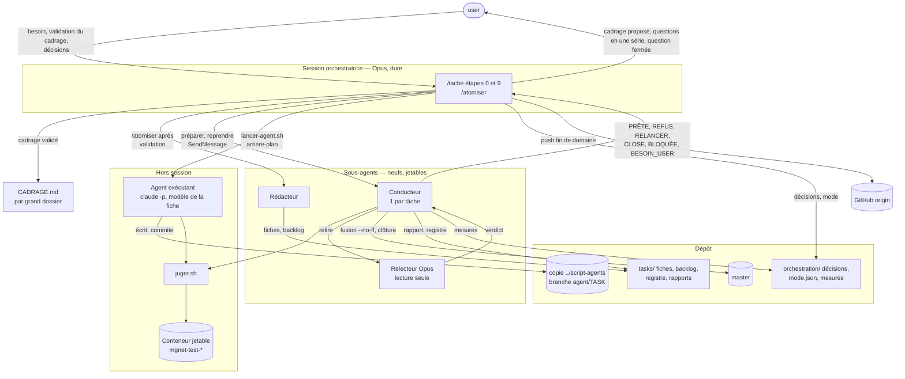
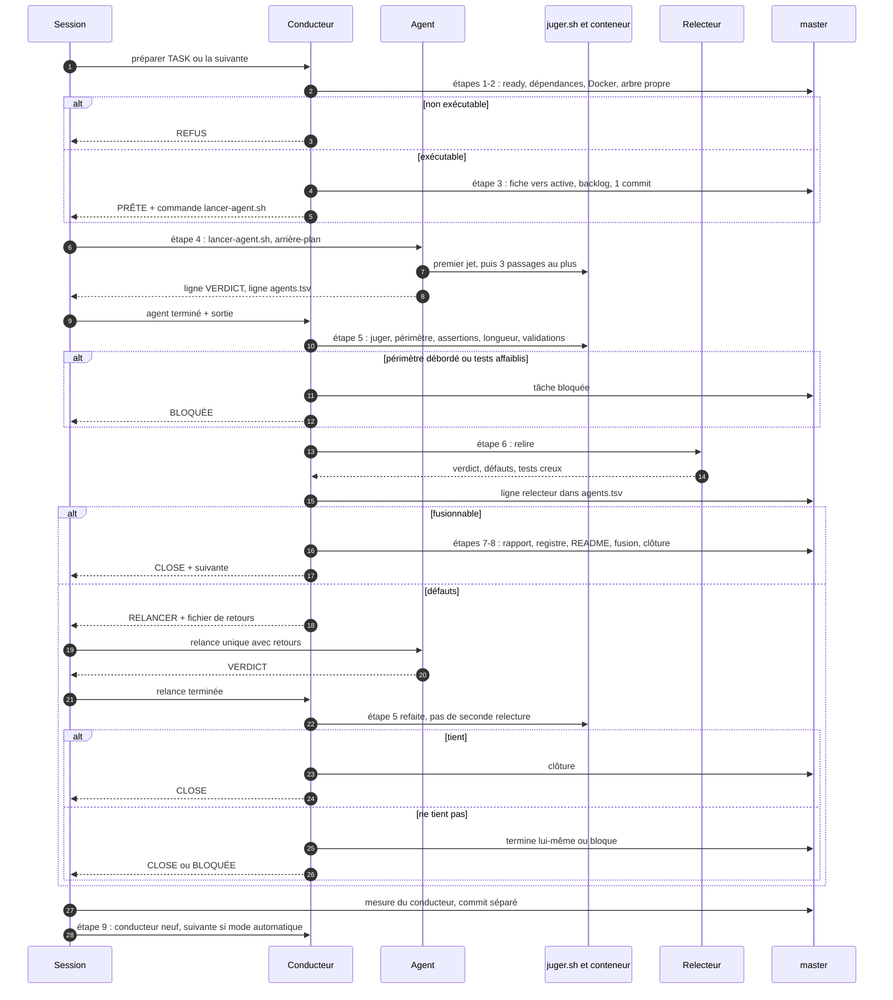
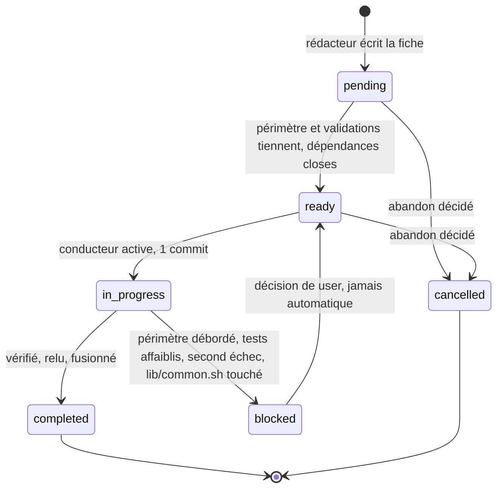

# Architecture de l'orchestration agentique

**Vue d'ensemble de référence** de la façon dont les agents IA produisent les scripts de
ce dépôt : qui intervient, où, avec quels artefacts, dans quel ordre, avec quels
contrôles. **Ses schémas sont la représentation graphique de référence** : ils sont
écrits ici en Mermaid et se modifient avec le texte, dans le même commit. Une évolution
de l'orchestration qui ne met pas ce fichier à jour est incomplète. L'affiche
[orchestration.png](orchestration.png), générée depuis [orchestration.html](orchestration.html), en est une présentation dessinée, datée : en cas
d'écart, ce fichier fait foi.

Pour les règles détaillées, ce fichier renvoie ; il ne les répète pas et ne les
remplace pas :

| Sujet | Fait foi |
|---|---|
| droits, commandes, Git, arrêt | [regles.md](regles.md) |
| décisions numérotées | [decisions.md](decisions.md) |
| cycle d'une tâche, pas à pas | [.claude/commands/tache.md](../.claude/commands/tache.md) |
| consignes de chaque rôle | [.claude/agents/](../.claude/agents/), [.claude/commands/](../.claude/commands/) |
| format des fiches, statuts, sélection | [tasks/README.md](../tasks/README.md) |
| écarts et dettes | [tasks/pending/TASK-039.md](../tasks/pending/TASK-039.md) (registre) |

En cas de désaccord entre ce fichier et une de ces sources, la source a raison et ce
fichier est à corriger.

---

## 1. Acteurs

| Acteur | Nature | Modèle | Consigne | Peut | Ne peut pas |
|---|---|---|---|---|---|
| **user** | humain | — | — | exprimer un besoin (jamais une commande), valider seul le cadrage, décider, reconnecter Claude Code, basculer `mode.json` | — |
| **Session orchestratrice** | session Claude Code interactive, qui dure | Opus | boucle de réflexion ([décision 49](decisions.md)) ; `/tache` étapes 0 et 9 ; `/atomiser`, appliqué après validation du cadrage, qui délègue au rédacteur | proposer un cadrage ; lancer conducteurs, rédacteurs et `lancer-agent.sh` en arrière-plan ; écrire décisions, `mode.json`, ce fichier ; commiter la mesure du conducteur ; pousser en fin de domaine | écrire un script ; vider son contexte (décision 46 amendée) |
| **Conducteur** | sous-agent Claude Code, neuf par tâche | Opus | [conducteur-tache.md](../.claude/agents/conducteur-tache.md), `/tache` étapes 1 à 8 | activer, vérifier, faire relire, écrire le fichier de retours, fusionner, clore ; terminer lui-même ou bloquer ; écrire lui-même une tâche `agent: orchestrateur` | lancer `lancer-agent.sh` ; pousser, rebaser, `reset --hard` ; appeler Python (absent de l'hôte, A87) |
| **Agent exécutant** | Claude Code sans interface (`claude -p`) | celui de la fiche : `deepseek` (modèle externe, [modeles/](modeles/)) ou `sonnet`/`opus`/`haiku` | [executer-tache.md](../.claude/commands/executer-tache.md) | écrire le script, son fichier de cas et un éventuel `config/*.env.example` ; lancer `juger.sh` ; `git add`/`commit` dans sa copie | tout ce que refuse [limites.json](limites.json) : `CLAUDE.md`, README, `tasks/`, `docs/`, `lib/`, `orchestration/`, `.claude/` ; `push`, `merge`, `rebase`, `reset`, `checkout`, `switch`, `worktree` ; web, sous-agents, MCP (décision 39) ; lecture des `config/*.env` |
| **Relecteur** | sous-agent, lecture seule | Opus | [relecteur.md](../.claude/agents/relecteur.md) | lire, rendre un verdict de 40 lignes au plus | écrire, lancer une commande |
| **Rédacteur** | sous-agent | hérité de la session | [redacteur-tache.md](../.claude/agents/redacteur-tache.md) | écrire des fiches dans `tasks/pending/`, mettre `tasks/backlog.md` à jour | écrire un script ; inventer une décision |
| **Juge** | script, sans modèle | — | [outils/juger.sh](outils/juger.sh), [outils/lien-ecrit.awk](outils/lien-ecrit.awk) | shellcheck, fichier de cas en conteneur, règles transverses, signal de longueur, refus d'un faux binaire écrit à travers un lien | — |

Un sous-agent Claude Code peut lancer un autre sous-agent (essai du 2026-09-16) : la
consigne confie donc la relecture au conducteur. Que le conducteur le fasse en pratique
reste à constater dans une session neuve (A59). Un Bash au premier plan est plafonné à
10 minutes : l'agent, qui peut tourner une heure (`DUREE_MAX`), reste lancé par la session.

## 2. Lieux

| Lieu | Contenu | Qui écrit |
|---|---|---|
| dépôt, branche `master` | tout ; y vont les activations, les clôtures, les mesures, les fusions `--no-ff` (tâches et atomisations), et les commits de la session (décisions, registre, `mode.json`, ce fichier) | session, conducteur |
| copie `../script-agents/<TASK>`, branche `agent/<TASK>` | `git worktree` créé par `lancer-agent.sh` ; supprimé à la clôture d'une tâche `completed`, gardé pour une tâche `blocked` | agent ; conducteur s'il termine lui-même |
| conteneur `mgnet-test-debian-*` / `mgnet-test-systemd-*` | exécution des tests, détruit après chaque appel | `tests/env/run-in-container.sh` |
| scratchpad de la session | textes pour le relecteur, fichiers de retours | conducteur |
| GitHub `origin` | `master`, poussé en fin de domaine | session |

Aucun script d'administration ne s'exécute sur l'hôte Windows, sur un serveur ni sur le
NAS ([regles.md](regles.md) §7).

## 3. Artefacts

| Artefact | Rôle | Écrit par | Lu par |
|---|---|---|---|
| `<dossier>/CADRAGE.md` | besoin, ensembles et contrat de chaque script d'un grand dossier ; il engage (décision 49) | session, validé par user seul | session, rédacteur, conducteur, relecteur |
| `docs/refactorisation-plan.md` | scripts du chantier initial, par domaine | user, session | rédacteur |
| `tasks/pending/`, `active/`, `completed/`, `blocked/`, `cancelled/` | une fiche par tâche ; le répertoire suit le statut | rédacteur, conducteur | tous |
| `tasks/backlog.md` | tableau des tâches, index du plan, identifiant libre | rédacteur, session, conducteur | session, conducteur |
| `tasks/pending/TASK-039.md` | **registre unique** des anomalies `Axx` | conducteur, session | tous |
| `tasks/reports/TASK-XXX-report.md` | compte rendu puis détail technique | conducteur | user |
| `orchestration/decisions.md` | décisions de user, numérotées | session | tous |
| `orchestration/mode.json` | `automatique` ou `manuel` | session, à la demande de user | session |
| `orchestration/mesures/agents.tsv` | une ligne par lancement d'agent, par relecture, par conducteur | `lancer-agent.sh`, conducteur, session | clôture, journal |
| `orchestration/mesures/journal.md` | une ligne par tâche livrée : coût, défauts, rattrapage | conducteur | user |
| fichier de retours (scratchpad) | défauts à corriger, remis à l'agent | conducteur | agent |
| README des domaines | rôle, scripts, risques, usage | conducteur | user |

## 4. Vue d'ensemble

## 5. Cycle d'une tâche

Une seule tâche dans `active/` à la fois ([tasks/README.md](../tasks/README.md) §4). Pas
de parallélisme tant que la décision 40 ne l'ouvre pas (trois tâches sans incident et
exécutions concurrentes du harnais maîtrisées, A06). Une seule relecture, une seule
relance de l'agent (décision 40).

À tout moment, le conducteur peut rendre `BESOIN_USER` (décision non tranchée, délai
de 600 000 ms dépassé) : la session pose la question et la boucle s'arrête.

Fiche `agent: orchestrateur` : pas de `lancer-agent.sh` ; le conducteur écrit lui-même
sur `agent/<TASK>` et conduit les étapes 1 à 8 d'un trait.

**Pratique non prescrite** (observée sur les domaines K3s et Kubernetes, absente de
l'étape 5 de `/tache`) : avant la relecture, le conducteur **sonde** le script en
conteneur avec des faux binaires qui journalisent, **mute** une copie jetable pour
vérifier que la suite échoue, et relance la suite plusieurs fois pour vérifier sa
**stabilité**. Après la relance, il rejoue ces sondes à la place d'une seconde
relecture. À décider : l'inscrire dans `/tache` ou non (A128).

## 6. États d'une tâche

L'ouverture `pending → ready` est déléguée (décision 3). Une fiche qui attend un choix
de user reste `pending` jusqu'à la décision numérotée. À chaque clôture, le conducteur
passe en `ready` les tâches qu'elle débloque. Le statut `validating`
([tasks/README.md](../tasks/README.md) §3) n'a servi qu'à une tâche d'orchestration qui se
prouvait à l'usage (TASK-049).

## 7. Du besoin au push

Aucune fiche ne naît hors de la boucle de réflexion de la [décision 49](decisions.md) :
user exprime un besoin en langage normal, la session lit le `CADRAGE.md` du dossier et
propose, user seul valide. Le plan initial n'alimente plus que le chantier en cours. Les
fiches d'orchestration nées d'un écart (pointillés) restent régies par la décision 46.

**Mesures produites** : chaque lancement d'agent (jetons lus dans le transcript de la
session, coût), chaque relecture et chaque conducteur ajoutent une ligne à
`agents.tsv` ; chaque tâche livrée ajoute une ligne au journal.

## 8. Contrôles et ce qu'ils prouvent

| Contrôle | Prescrit par | Prouve | Ne prouve pas |
|---|---|---|---|
| `juger.sh` | `/tache` 5.1, `executer-tache` §3 | shellcheck ; fichier de cas sans échec en conteneur (cas sautés admis) ; règles transverses ; signal de longueur ; aucun faux binaire écrit à travers un lien | que les tests testent quelque chose |
| périmètre `git diff --name-only` | `/tache` 5.2 | aucun fichier hors `scope` | — |
| comptage des assertions, lecture des diffs de tests | `/tache` 5.3 | aucun test retiré ni affaibli sans justification | la pertinence des tests |
| longueur `wc -l` | `/tache` 5.4 | dépassement signalé au relecteur | — |
| commandes du champ `validation` | `/tache` 5.5 | codes réels, lint en conteneur | — |
| relecture Opus | `/tache` 6 | critères, défauts, tests creux, lus dans le code | l'exécution réelle |
| chaque réserve porte un `Axx` existant | `/tache` 7 | rien de perdu à la clôture | — |
| `verifier-liens.sh` | `/tache` 8.6 | aucun lien Markdown mort après déplacement de fiche | — |
| sondes, mutations, stabilité | pratique non prescrite (A128) | comportement sur les chemins à risque ; suite qui échoue quand le script est faux ; test déterministe | comportement contre un vrai système |

**Limite commune** : les tests tournent contre des faux (`kubectl`, `helm`, `systemctl`,
`ufw`…) dont les messages sont parfois imités de mémoire. Aucun script n'est éprouvé sur
un vrai serveur tant qu'un essai sur machine virtuelle n'a pas eu lieu.

## 9. Arrêts et reprise

Conditions d'arrêt de la boucle : `/tache` étape 9 et [regles.md](regles.md) §15. La
dernière tâche d'un domaine n'arrête pas la boucle : la session pousse, fait un point
d'étape, puis enchaîne s'il reste une tâche `ready`.

| Incident | Reprise | Source |
|---|---|---|
| identifiant du conducteur perdu (compaction) | conducteur neuf avec « reprendre TASK-XXX » ; l'état est dans la fiche, la branche, le rapport | `/tache` étape 0 |
| limite d'usage Claude pendant un conducteur | constater Git et la copie, puis SendMessage au même conducteur : « reprise » | pratique (sessions du 2026-09-16 et 17) |
| transcript de l'agent introuvable | ligne `incomplet` dans `agents.tsv`, jetons « non relevé » au journal | `lancer-agent.sh`, `/tache` 8.5 |
| Docker Desktop indisponible | arrêt signalé | décision 42 |
| conteneur de test bloqué | `docker rm -f` des seuls `mgnet-test-*`, cause cherchée dans le fichier de cas | regles.md §8, A122 |

## 10. Écarts connus entre prévu et réel

Chaque écart vit dans le registre ; cette liste ne fait que les signaler.

| Prévu | Réel | Registre |
|---|---|---|
| tâches à effets enchaînés ou destructives confiées à `sonnet` | toutes confiées à `deepseek` : l'agent Sonnet sans interface échoue sur l'authentification | A41 |
| le conducteur lance lui-même le relecteur | non encore constaté : dans la session qui a introduit ce mode, la définition du conducteur était en cache et la session lançait le relecteur | A59 |
| une seule relecture par tâche | la version corrigée après relance n'est jamais relue par Opus ; le conducteur vérifie les majeurs dans le code et par sondes | A64, A67, A72, A75… |
| 150 lignes par script et par fichier de cas | dépassements fréquents, justifiés sur la ligne VERDICT | A92, A105, A121… |
| chaque commit porte `Tâche : TASK-XXX` | les commits de l'agent ne la portent pas : `executer-tache.md` ne la lui demande pas | A66 |
| contrôles de l'étape 5 | sondes, mutations et stabilité pratiquées sans être prescrites | A128 |
